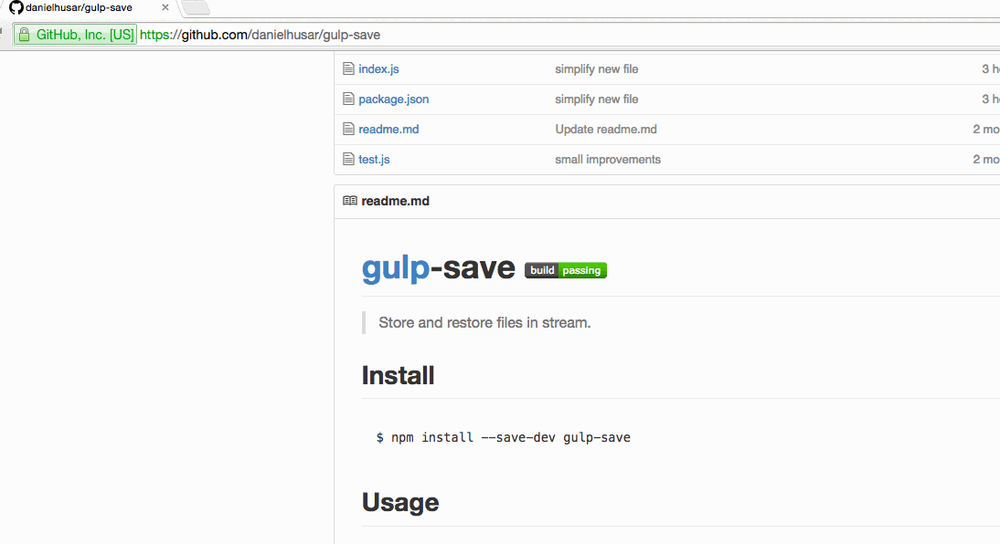

# Github Npm

Add links to npm libraries in github and npm readmes

## Install

Install it from chrome store, or download this repo and load unpacke extension.

## Example

## License

MIT © [Daniel Husar](https://github.com/danielhusar)
